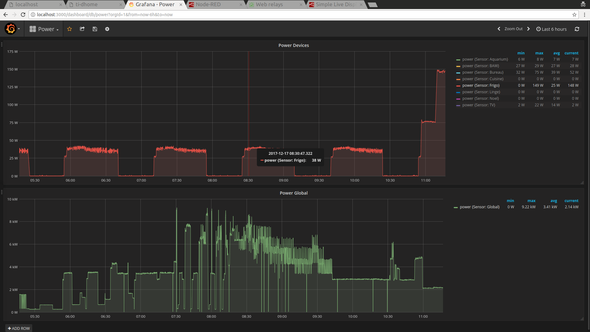
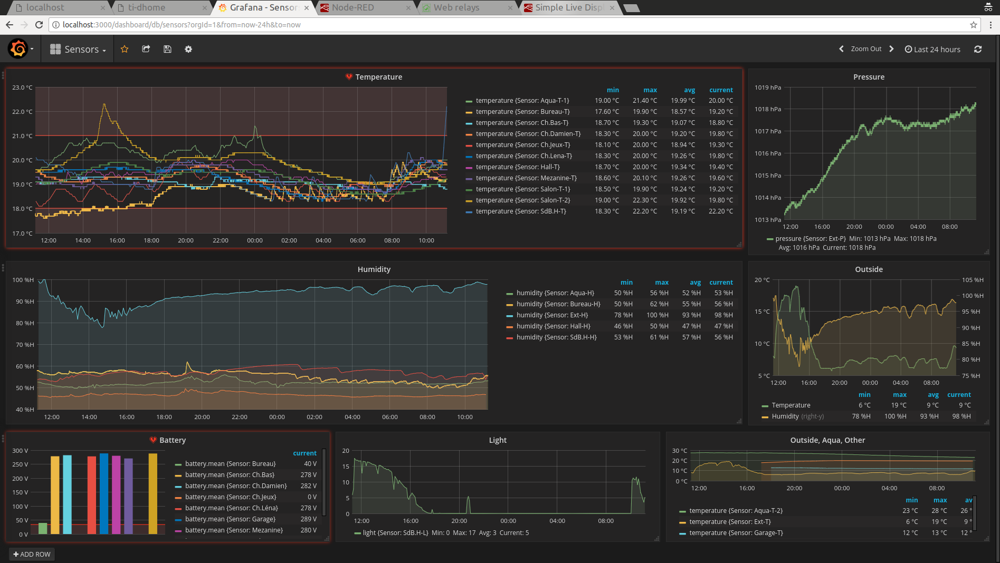
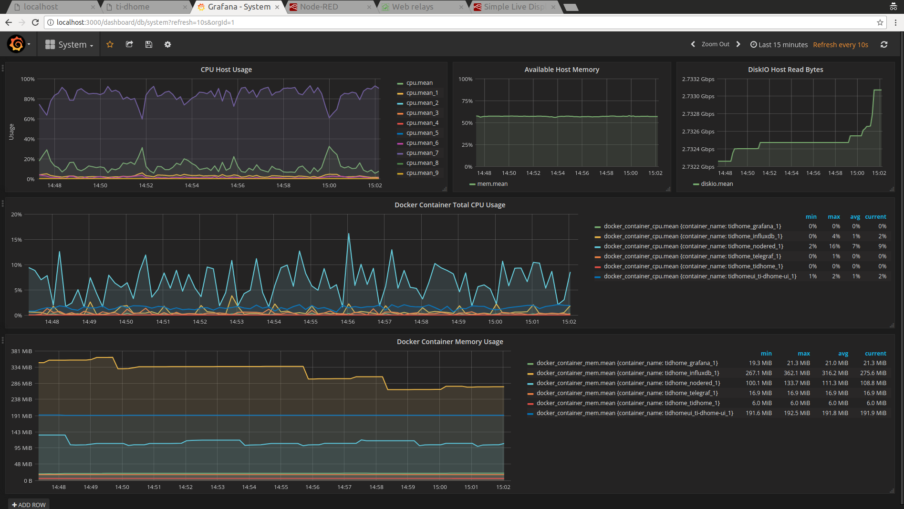
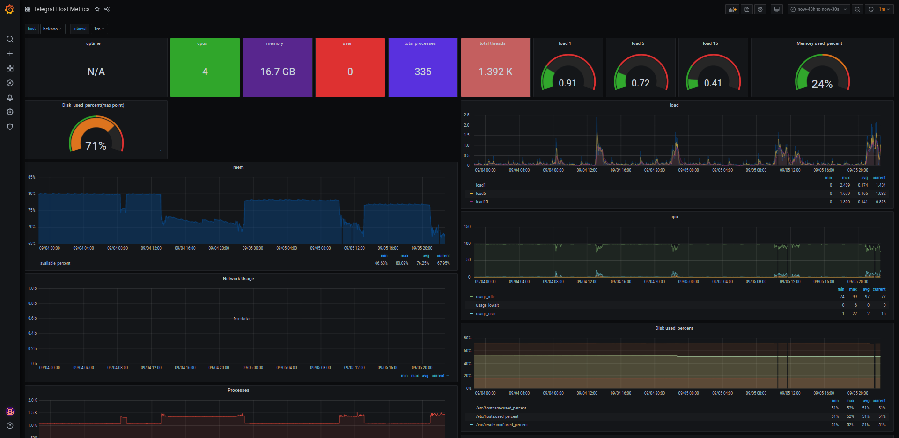

:toc:

ifdef::env-github[]
:imagesdir: /docs
endif::[]

= Ti-DHome

This is a Home automation project. Pronounced "Ti d'Homme" stands for *little man* in French. +
This GIT project is a hat project with a set of sub-projects enabling Home Automation.

image:images/schema-architecture.jpg?raw=true[Overview]

.Example Usage
[TIP]
====
Sensors (DIY or proprietary) are sending room temperatures, motion or doors state. +
A small and flexible Node-Red workflow allows to orchestrate heaters based on simple rules around sensors values and/or schedule and/or external weather.
====

== Design

=== Principle

The source and explanation in this repository are following few principles:

* Avoid complex monolithic framework used here and there on automation
* Avoid using proprietary gateways named *boxes* such as any IKEA, Xiaomi, Amazon Echo, Leroy Merlin, etc
* Use (or re-use) available technology, avoid deprecation, but stay open to new technology
* Client(s)/server(s) plugs together using *ANY* progamming language by leveraging message queues (MQTT) when necessary
* DIY sensors or Web device are using simple arduino sketches
* Each element (e.g. Timeseries datastore) can be any, or multiple, and are interchangeable
* Deploy as much as possible with automation in mind, using link:https://www.docker.com/[Docker]

=== Architecture

There are only few technical concepts:

* Communication of each element from the system is done through messaging system *MQTT bus* (mosquitto)
* *Node-red* enables loosely coupled custom workflow strategies

image:images/architecture-bus.png?raw=true[Architecture]

In turns, this simplistic approach allows very flexible and powerful Home Automation.

=== Material

Hardware used for sensors/actors:

* Fanless low-consumption servers (e.g. Core i3 with SSD, or RaspberryPi)
* link:http://www.currentcost.com/product-envir.html[CurrentCost EnviR] to measure 230v main + 9 plugs
* link:http://www.rfxcom.com/[RFXtrx433] to record Weather Station measures, trigger Window motor openers, or monitor alarm
* link:https://aeotec.com/z-wave-usb-stick/[ZWave] or link:https://phoscon.de/en/conbee2[ZigBee] USB sticks as gateways (with minimal footprint) to proprietary devices
* link:https://github.com/kalemena/ti-dhome-web-relay-board[DIY Web relays board]
* link:https://github.com/kalemena/ti-dhome-sensors[DIY Arduino sensors 866Mhz] (15+ low cost sensors)
* Few cheap components (for EDF téléinfo which is Electric French Main power counters)

=== Dashboard

A simple Dashboard uses Grafana and InfluxDB as storage.

== How-To

This project can be entirely or partialy reproduced. +
Hence this is not required to buy everything above mentioned to be working for Ti-Dhome. +
If you need to control ZigBee devices, just implement relevant part of this project.

=== Setup modules

==== Orchestrator

Central to all the Orchestration of IoT is a docker container with link:http://nodered.org[Node RED]. +
Node-Red enables loosely coupled custom workflow strategies. +
IoT devices can therefore be wired from monitoring to action. +
Node-Red is like the advanced modern IFTTT (If This Then That) service, with much much more powerful integration capabilities, at the cost a requiring a little bit more effort to use :-)

Because Ti-Dhome requires few defaults and libs installed, a specific Docker version is cooked. +
Check link:https://github.com/kalemena/docker-node-red[Ti-Dhome - Docker Node-Red (external git project)]

==== Databases & Monitoring

Use any, as appropriate for your use-case. +
Ti-Dhome uses link:https://www.influxdata.com/products/influxdb-overview/[InfluxDB] to store Timeseries on sensors metrics. +

InfluxDB is generally used in stack with monitoring of system, with link:https://github.com/influxdata/telegraf[Telegraf] and link:https://grafana.com/[Grafana]. +

This is how this is deployed as link:https://github.com/kalemena/install-howto/tree/master/monitoring[Ti-Dhome - Monitoring stack]

==== IoT Gateways

Here are gateways integrated OK in Ti-Dhome:

* link:https://github.com/kalemena/ti-dhome-web-relay-board[Ti-Dhome - Web Relays (external git project)]
* link:https://github.com/kalemena/ti-dhome-sensors[Ti-Dhome - Sensors (external git project)]
* link:/docs/modules/gateways-usb-currentcost[Gateway USB CurrentCost]
* link:/docs/modules/gateways-usb-rfxtrx433[Gateway USB RfxTrx433]
* link:/docs/modules/gateways-usb-teleinfo[Gateway USB Téléinfo]
* link:https://github.com/kalemena/iot-tools/tree/master/docs/gateways/zigbee[ZigBee (example usage for Ti-DHome)]
* link:https://github.com/kalemena/iot-tools/tree/master/docs/gateways/zwave[ZWave (example usage for Ti-DHome)]

=== Deployment

* install link:https://www.docker.com/[Docker]
* clone this repository

    $ git clone https://github.com/kalemena/ti-dhome.git

* edit the docker-compose.yml to map your USB gateway devices.
* start Node-RED

    $ make start

** connect to link:http://localhost:1880[], change the project flow. 

==== Strategies (aka Node-red flows)

image:images/nodered-sensors-input.png?raw=true[Node-RED Flows]

==== Security

    $ openssl req -subj '/CN=localhost' -x509 -newkey rsa:4096 -nodes -keyout key.pem -out cert.pem -days 365

== Links

link:https://air.imag.fr/index.php/Developing_IoT_Mashups_with_Docker,_MQTT,_Node-RED,_InfluxDB,_Grafana[]
