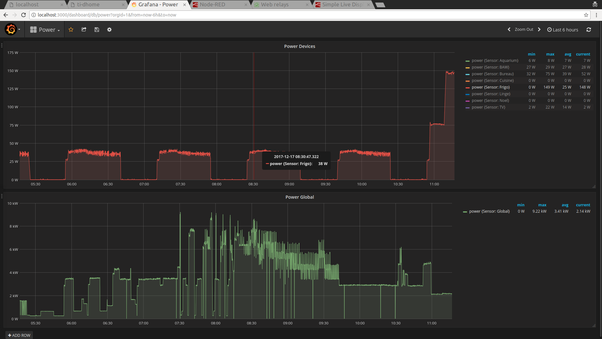
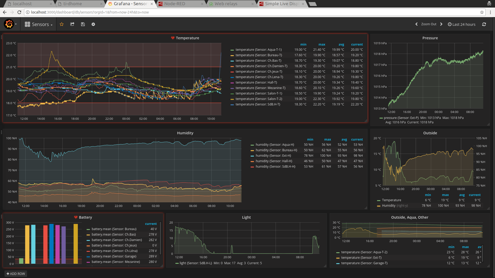
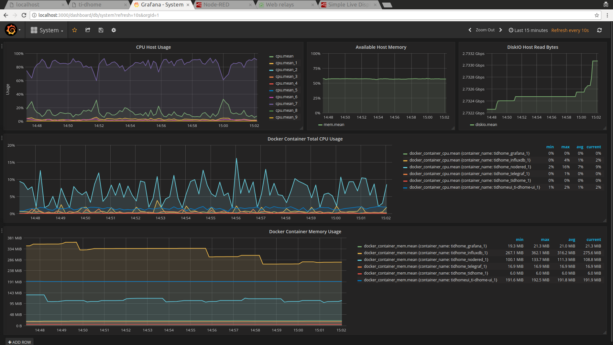

:toc:

= Ti-DHome

ifdef::env-github[]
:imagesdir: /
endif::[]

This is a Home automation project. Pronounced "Ti d'Homme" stands for *little man* in French.

Home server monitors and act on various environment events such as sensors.

This project serves has hat documentation for a set of sub-projects enabling my Home Automation.

For example, sensors send room temperatures, and a small but flexible workflow allows to orchestrate heaters in these rooms, taking into account time of day, week/year period, absence from home and global weather feeds.

image:res/Schema.png?raw=true[Hardware overview]

== Design

=== Principle

The source and explanation in this repository are following few principles:

* avoid complex monolithic framework used here and there on automation
* client(s)/server(s) plugs together using *ANY* progamming language by leveraging message queues (MQTT)
* simple arduino sketches for sensors
* simple datastore (any, multiple, interchangeable)
* deploy as much as possible with automation using for example link:https://www.docker.com/[Docker]

=== Architecture

There are only 2 core concepts:

* Communication of each element from the system is done through messaging system *MQTT bus* (mosquitto)
* *Node-red* enables loosely coupled custom workflow strategies

image:res/architecture-bus.png?raw=true[Architecture]

In turns, this simplistic approach allows very flexible and powerful Home Automation.

=== Material

Hardware used for sensors/actors:

* Fanless low-consumption servers (e.g. Core i3 with SSD, or RaspberryPi)
* link:https://github.com/kalemena/ti-dhome-web-relay-board[Web relays board]
* link:https://github.com/kalemena/ti-dhome-sensors[Arduino 866Mhz DIY sensors] (15+ low cost sensors)
* link:http://www.currentcost.com/product-envir.html[CurrentCost EnviR] to measure 230v main + 9 plugs
* link:http://www.rfxcom.com/[RFXtrx433] to record Weather Station measures, trigger Window motor openers, or monitor alarm
* Few cheap components (for EDF téléinfo which is Electric French Main power counters)

=== Dashboard

A simple Dashboard uses Grafana and InfluxDB as storage.

== How-To

=== Setup modules

Everything can be setup at need.

* link:https://github.com/kalemena/ti-dhome-web-relay-board[Web Relays]
* link:/modules/teleinfo[Téléinfo]
* link:/modules/rfxtrx433[RfxTrx433]
* link:/modules/currentcost[CurrentCost]
* link:https://github.com/kalemena/ti-dhome-sensors[Sensors]
* Database is up to user. InfluxDB is nice, but this is not shared for now.

=== Deployment

There is no specific service.

Instead there is a docker container with link:http://nodered.org[Node RED].

A set of strategies are loaded in Node-RED to allow integration of the various components.

* steps: 
** install link:https://www.docker.com/[Docker]
** clone this repository

    $ git clone https://github.com/kalemena/ti-dhome.git

** edit the docker-compose.yml to map your USB devices.
** start Node-RED

    $ docker-compose up -d

** connect to http://localhost:1880, change the project flow based on need. 

=== Strategies (aka Node-red flows)

image:res/nodered-sensors-input.png?raw=true[Node-RED Flows]

== Security

    $ openssl req -subj '/CN=localhost' -x509 -newkey rsa:4096 -nodes -keyout key.pem -out cert.pem -days 365

== Links

https://air.imag.fr/index.php/Developing_IoT_Mashups_with_Docker,_MQTT,_Node-RED,_InfluxDB,_Grafana

https://github.com/GladysAssistant/Gladys/blob/master/docker/Dockerfile